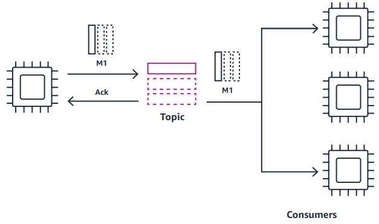
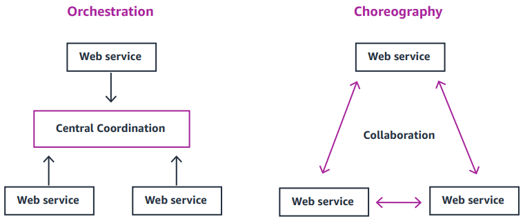

# Event driven architecture

## Point-to-point messaging

It's one to one relation in which sender use queue to asynchronusly invoke another service. This eliminates the retry logic etc, because sender don't need exactly details about receiver and it's current state.

Can be implemented with: [[SQS]]

---

## Pub/Sub model

Pub/sub messaging is a way in which producers send the same message to many consumers. Publish subscribe messaging allows you to broadcast messages and send a copy to each consumer. The event broker in these models is frequently an event router. Unlike queues, event routers typically don’t offer persistence of events.

### Topic fan out

One type of event router is a topic, a messaging destination that facilitates hub-and-spoke integrations. In this model, producers publish messages to a hub, and consumers subscribe to the topics of their choice.

Can be implemented with: [[SNS]]

### Event routing

Another type of event router is an event bus, which provides complex routing logic. While topics push all sent messages to subscribers, event buses can filter the incoming flow of messages and push them to different consumers based on event attributes.

Can be implemented with: [[EventBridge]]

---

## Choreography and orchestration 

Choreography and orchestration are two different models for how distributed services can communicate with one another. Many applications use both choreography and orchestration for different use cases. 

### Orchestration

In orchestration, communication is more tightly controlled. A central service coordinates the interaction and order in which services are invoked. Often within a [bounded context](https://martinfowler.com/bliki/BoundedContext.html), you need to control the sequence of service integration, maintain state, and handle errors and retries. These use cases are better suited for orchestration.

Can be implemented with: [[StepFunction]]

### Choreography

Choreography achieves communication without tight control. Events flow between services without any centralized coordination. Communication between bounded contexts is often how choreography is used most effectively.

Can be implemented with: [[EventBridge]] or [[Apache Airflow]]

## Event streaming 

The use of streams, or continuous flows of events or data, is another method of abstracting producers and consumers. In contrast to event routers, though comparable to queues, streams typically require consumers to poll for new events. Consumers maintain their unique filtering logic to determine which events they want to consume while tracking their position in the stream.
Event streams are continuous flows of events, which may be processed individually or together over a period of time.

Can be implemented with: [[Kinesis Streams]] or [[Kafka]]

---

## Additional Resources

- [Advantages of the event-driven architecture pattern](https://developer.ibm.com/articles/advantages-of-an-event-driven-architecture/)