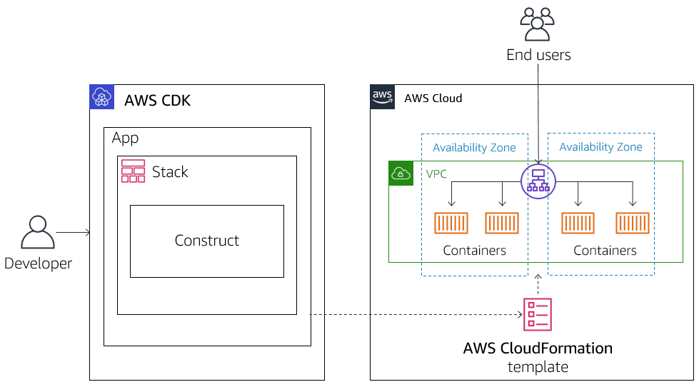
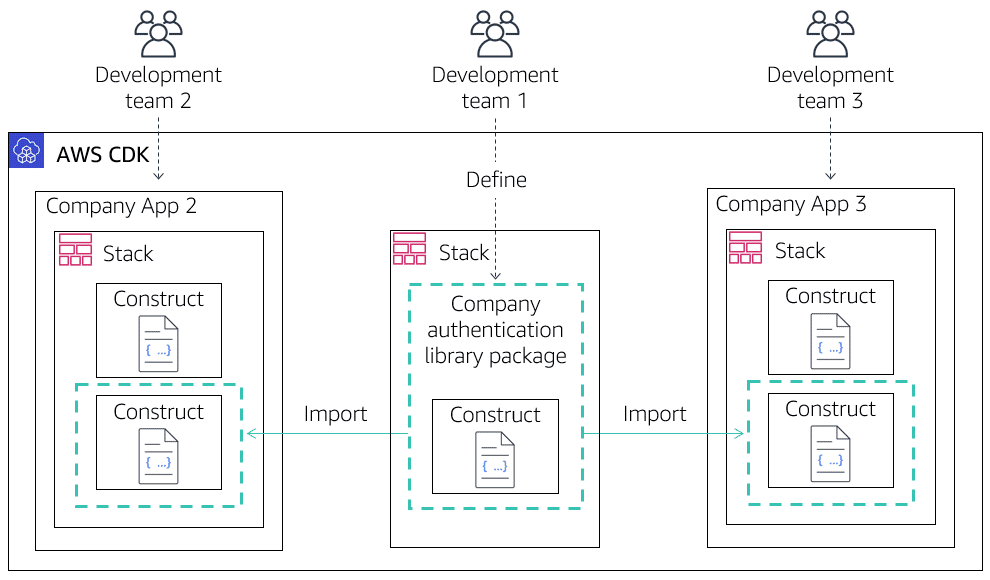
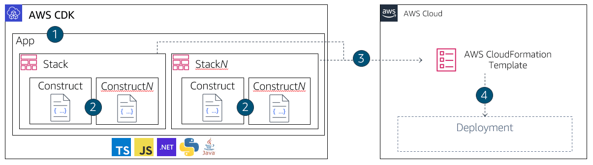
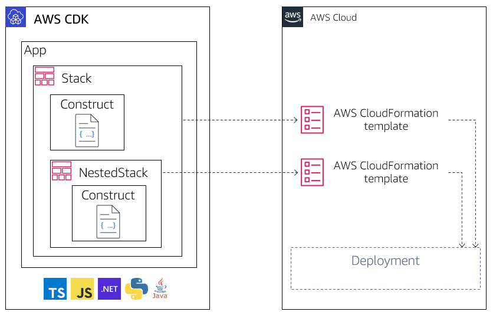
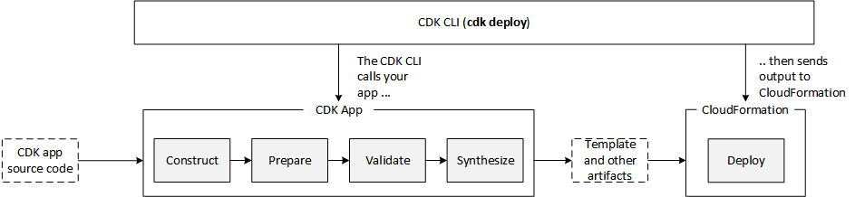

# CDK

- [CDK Workshop](https://cdkworkshop.com/60-go/40-hit-counter.html)
- [CDK Docs](https://docs.aws.amazon.com/cdk/v2/guide/home.html)
- [AWS CDK Solutions Constructs](https://aws.amazon.com/ru/solutions/constructs/)

## What is CDK

AWS CloudFormation templates are used to create the cloud infrastructure. AWS CDK then uses the templates to create cloud infrastructure. AWS CDK also enables developers to use common code-development practices by offering tools to check for potential problems, identify code differences, and bootstrapping resources needed for deployment.
mod1_what_does_the_aws_cdk_do.png



## Core elements

### Constructs

Constructs are the basic building blocks of AWS CDK apps. A construct represents a cloud component and encapsulates everything that AWS CloudFormation needs to create the component. A construct can represent a single cloud resource (such as an AWS Lambda function), or it can represent a higher-level component consisting of multiple AWS CDK resources.

AWS CDK includes the AWS Construct Library, which contains constructs representing Amazon Web Services (AWS) resources. This library includes constructs that represent all the resources available on AWS.

Constructs divided into 3 levels:
- L1 constructs mathced 1to1 to CloudFormation resources
- L2 constructs provide more abstraction and default best practices
- L3 constructs incorporate more then one Resource to build ready to use solution

### Stack

Stacks are a unit of deployment in AWS CDK. All AWS resources defined within the scope of a stack, directly or indirectly, are provisioned as a single unit. Because AWS CDK stacks are implemented through AWS CloudFormation stacks, they have the same limitations. You can define any number of stacks in an AWS CDK app.

### App

Your CDK application is an app, and is represented by the AWS CDK App class. To provision infrastructure resources, all constructs that represent AWS resources must be defined, directly or indirectly, within the scope of a stack construct.

## Construct hierarchy

The composition of constructs means that you can define reusable components and share them like any other code. Teams within a company can define and distribute constructs as they would any other code library package. When one team updates a code library, developers on other teams can get the latest version and deploy any bug fixes and improvements.



## AWS CDK development workflow



1. Create the app from a template provided by AWS CDK.
2. Add code to the app to create resources within the stack.
3. Synthesize one or more stacks in the app to create an AWS CloudFormation template.
4. Deploy one or more stacks to your AWS account.

## Nested stacks



Each nested stack can contain up to 200 resources while only counted as 1 resource in the parent stack. During app synthesis, each nested stack is synthesized into its own AWS CloudFormation template. Nested stacks are not treated as independent deployments and cannot be individually deployed or listed. However, references between parent stacks and nested stacks are automatically translated to stack parameters and outputs in the generated AWS CloudFormation templates.

## CDK concepts

### Identifiers

- **Construct IDs** -id is the most common identifier. It is passed as the second argument when instantiating a construct. This identifier must be unique only in the scope in which it is created, which is the first argument when instantiating a construct.
- **Paths** - The constructs in an AWS CDK application form a hierarchy rooted in the App class. This hierarchy is called a path. 
- **Unique IDs** - AWS CDK requires that all identifiers in an AWS CloudFormation template are unique. To meet this requirement, AWS CDK generates a unique identifier for each construct in an application. AWS CDK uses the construct path to generate an eight-character hash.
- **Logical IDs** - Unique IDs serve as the logical identifiers of resources in the generated AWS CloudFormation templates for those constructs that represent AWS resources. Logical identifiers are sometimes called logical names.

### Environments

Environment (env) represents the AWS account and AWS Region in which a stack is deployed. AWS CDK selects the default Region and account in your current AWS CLI profile. However, you can manually override the environment by specifying a different set of values than the default.  

### Contexts

Context values are key-value pairs that can be associated with a stack or construct. AWS CDK uses context to cache information from your AWS account, such as the Availability Zones in your account or the Amazon Machine Image (AMI) IDs used to start your instances. You can create your own context values that your apps or constructs can use. 

Context values that you create are scoped to the construct that created them, meaning they are visible to child constructs but not to siblings. Context values set by the AWS CDK Toolkit are set on the App construct, and so they are visible to every construct in the app.

To retrieve the cached context values from your AWS account, use the following AWS CDK command:

```bash
cdk context
```

The resulting information is also visible in various locations, including the `cdk.context.json` project file.

### Assets

Assets are local files, directories, or Docker images that can be bundled into AWS CDK libraries and apps.

## AWS CDK Toolkit

Use the AWS CDK Toolkit to:

- Create and run your application.
- Interrogate the application model that you defined.
- Produce and deploy the AWS CloudFormation templates generated by the AWS CDK.

Use of the AWS CDK Toolkit requires the installation of AWS CLI and configuring a default profile with your AWS account security credentials (access key ID and secret access key).

### Bootstrapping your AWS environment

Deploying AWS CDK applications into your AWS account might require that you provision resources the AWS CDK needs to perform the deployment. The process of provisioning these initial resources is called bootstrapping. You need to bootstrap only if you are deploying a stack that requires these dedicated resources. The cdk bootstrap command creates an Amazon S3 bucket in your default Region, unless you specify a profile that contains the required credentials or Region.

### Commands

| Command                | Function                                                                                    |
| ---------------------- | ------------------------------------------------------------------------------------------- |
| cdk list (ls)          | Lists the stacks in the application                                                         |
| cdk synthesize (synth) | Synthesizes and prints the AWS CloudFormation template for the specified stack or stacks    |
| cdk bootstrap          | Deploys the AWS CDK Toolkit stack, required to deploy stacks containing assets              |
| cdk deploy             | Deploys the specified stacks                                                                |
| cdk destroy            | Destroys the specified stacks                                                               |
| cdk diff               | Compares the specified stack with the deployed stack or a local AWS CloudFormation template |
| cdk metadata           | Displays metadata about the specified stack                                                 |
| cdk init               | Creates a new AWS CDK project in the current directory from a specified template            |
| cdk context            | Manages cached context values                                                               |
| cdk docs (doc)         | Opens the AWS CDK API reference in your browser                                             |
| cdk doctor             | Checks your AWS CDK project for potential problems                                          |

### Synthesizing stacks

The cdk synth command synthesizes a stack defined in your application into an AWS CloudFormation template. 

### Deploying stacks

The cdk deploy command provisions your stacks into your AWS account after successful synthetization of your application into a template. This process includes the creation of cloud resources, security groups, and IAM changes necessary to administer your deployment. 

### App lifecycle



1. **Construction (or Initialization)**
Your code instantiates all of the defined constructs and then links them together. In this stage, all of the constructs (app, stacks, and their child constructs) are instantiated and the constructor chain is executed. Most of your app code is executed in this stage.

2. **Preparation**
All constructs that have implemented the prepare method participate in a final round of modifications, to set up their final state. The preparation phase happens automatically. As a user, you don't see any feedback from this phase. It's rare to need to use the "prepare" hook, and generally not recommended. Be very careful when mutating the construct tree during this phase, because the order of operations could impact behavior.

3. **Validation**
All constructs that have implemented the validate method can validate themselves to ensure that they're in a state that will correctly deploy. You will get notified of any validation failures that happen during this phase. Generally, we recommend performing validation as soon as possible (usually as soon as you get some input) and throwing exceptions as early as possible. Performing validation early improves diagnosability as stack traces will be more accurate, and ensures that your code can continue to execute safely.

4. **Synthesis**
This is the final stage of the execution of your AWS CDK app. It's triggered by a call to app.synth(), and it traverses the construct tree and invokes the synthesize method on all constructs. Constructs that implement synthesize can participate in synthesis and emit deployment artifacts to the resulting cloud assembly. These artifacts include AWS CloudFormation templates, AWS Lambda application bundles, file and Docker image assets, and other deployment artifacts. Cloud assemblies describes the output of this phase. In most cases, you won't need to implement the synthesize method.

5. **Deployment**
In this phase, the AWS CDK Toolkit takes the deployment artifacts cloud assembly produced by the synthesis phase and deploys it to an AWS environment. It uploads assets to Amazon S3 and Amazon ECR, or wherever they need to go. Then, it starts an AWS CloudFormation deployment to deploy the application and create the resources.

### Comparing stacks

The cdk diff command compares a stack defined in your app with the current version in development. 

### Troubleshooting the AWS CDK construct

Use the cdk doctor command to collect information that helps troubleshoot problems with the AWS CDK applications and stacks.

### Removing stacks

If you no longer have a use for a deployed stack, use the cdk destroy command to remove all resources in the stack from your AWS account.

## Working with the AWS CDK

### AWS CDK programming logic

By design, AWS CDK is an open-source software development framework. You can use object-oriented development techniques to build your applications and constructs.

You can also use programming logic, such as if statements and for-loops, when defining your infrastructure.

### Design best practices

#### Testing

- Treat test code like application code. Test code has an equally long lifetime and is equally subject to change.
- Do not assert too much in one test. A test should test only one behavior. If you accidentally break that behavior, only one test will fail. The test name should indicate exactly what is broken.

Perform validation as soon as possible (usually as soon as you get some input) and raise exceptions as early as possible.

#### Tagging

Tag your stacks. AWS CDK makes tagging easy and tags are applied recursively throughout the stack. For more information, see “Tagging” in the AWS Cloud Development Kit Developer Guide.

#### Constructs

High-level constructs can be excessive for small projects. Know what is deployed in your stack. This helps avoid using and paying for more resources than you need. Though the AWS CDK is generally available, some constructs in the library might still be under active development. Check the documentation for the status of specific modules.

#### Patterns

Enforce software design patterns with defaults and organizational policies during construct development.

#### Deployments

Include the output of the cdk diff command in the code review. Deploy AWS CDK changes as part of a CI/CD pipeline.

#### Limitations

High-level constructs support only some of the options of the AWS CloudFormation resource they modify. In this case, add a property override or use the low-level construct directly.

## Resources

- [bobbyhadz blog](https://bobbyhadz.com/)
- [CDK Best practices. RanTheBuilder](https://www.ranthebuilder.cloud/post/aws-cdk-best-practices-from-the-trenches)
- [Open CDK Guide](https://github.com/kevinslin/open-cdk#tools-and-libraries)
- [AWS Solutions Constructs](https://docs.aws.amazon.com/solutions/latest/constructs/welcome.html)
- [Construc Hub](https://constructs.dev/)
- [CDK Workshop](https://cdkworkshop.com)

How to structure infrastructure:

- [Recommended AWS CDK project structure](https://aws.amazon.com/ru/blogs/developer/recommended-aws-cdk-project-structure-for-python-applications/)
- [Where Should I Store My IaC?](https://devops.com/where-should-i-store-my-iac/)
- https://dev.to/n3wt0n/i-store-my-infra-as-code-this-way-you-should-too-1pa3


**Videos:**

- https://www.youtube.com/watch?v=R3AEIIw98j4&list=WL&index=5 
- https://www.youtube.com/watch?v=ndd9XwQZbyM&list=WL&index=30
- https://www.youtube.com/watch?v=RmwKBPCo7o4&list=WL&index=28
- https://www.youtube.com/watch?v=Q1FcifrDocE
