# Network

## AWS Shared Responsibility Model

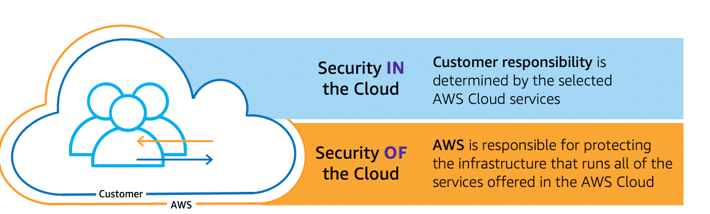

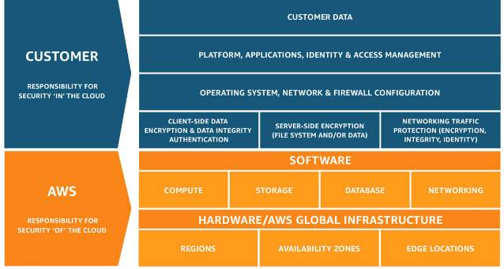

## Tools for monitoring and troubleshooting 

- Amazon CloudWatch
- VPC Flow Logs
- Traffic Mirroring
- VPC Reachability Analyzer
- AWS Transit Gateway Network Manager

## How to implement network security

- **Firewalls** are a system designed to prevent unauthorized access to or from a private network. You can implement a firewall in either hardware or software form, or a combination of both. Firewalls prevent unauthorized internet users from accessing private networks connected to the internet, especially intranets.
- **Packet sniffers**, also known as a packet analyzer, protocol analyzer or network analyzer, are pieces of hardware or software used to monitor network traffic. Sniffers work by examining streams of data packets that flow between computers on a network and also flow between networked computers and the larger internet.
- **Penetration testing** software or penetration tools help in identifying security weaknesses in a network, server, or web application. These tools are useful to identify the unknown vulnerabilities in the software and networking applications that can cause a security breach.

## AWS Private Link
AWS PrivateLink provides a private connection between your VPCs and supported AWS services. This AWS service provides secure usage within the AWS network and avoids exposing traffic to the public internet.

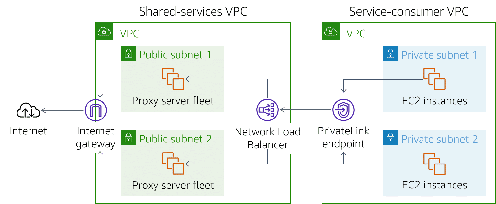

## VPC Endpoint

A VPC endpoint enables customers to privately connect to supported AWS services and VPC endpoint services powered by AWS PrivateLink. Amazon VPC instances do not require public IP addresses to communicate with resources of the service. Traffic between an Amazon VPC and a service does not leave the Amazon network. VPC endpoints are horizontally scaled, redundant, and highly available Amazon VPC components that allow communication between instances in an Amazon VPC and services without imposing availability risks or bandwidth constraints on network traffic. It's powered by AWS Private Link. There are two types of VPC endpoints:

- interface endpoints
- gateway endpoints

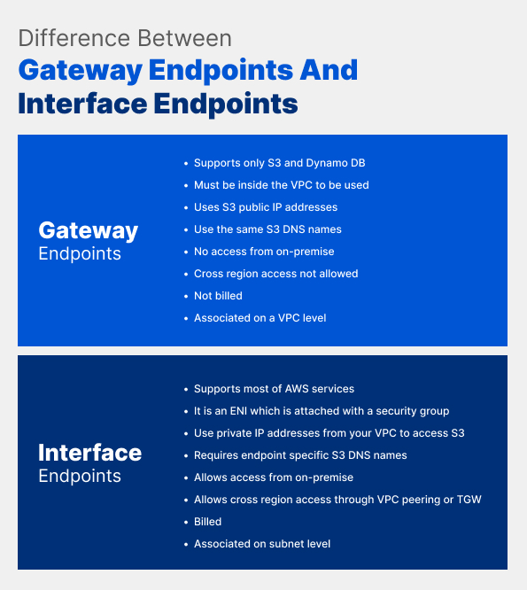

### Interface endpoint
An interface endpoint is an elastic network interface (ENI) similar to a virtual network card but with a private IP address. The private IP will be from the IP address range of the subnet already specified by the user. This ENI will act as the main entry point for the traffic going to any supported AWS service. 

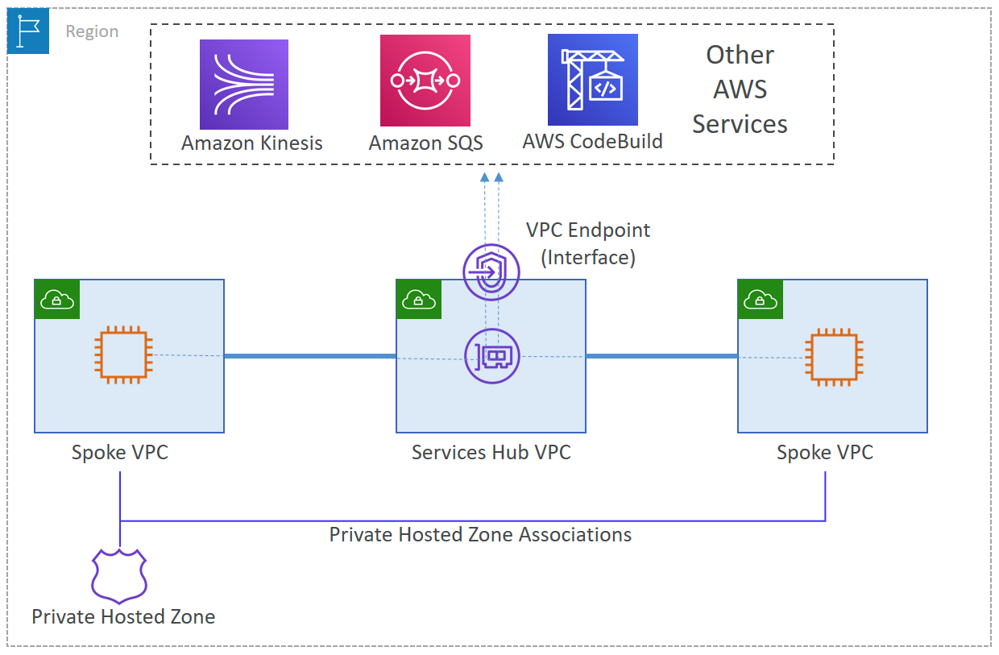

### Gateway endpoint

Using Gateway endpoints does not incur any data processing or hourly charges. It creates an entrypoint for traffic routed to S3 or DynamoDB (only this 2 services support gateway endpoint). Gateway endpoint should be added to vpc route table.

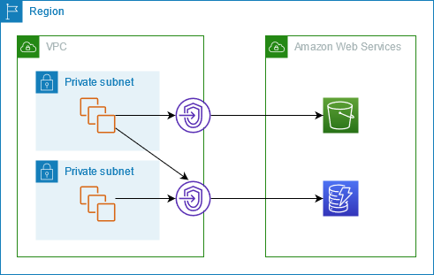

## VPC Peering
A VPC peering connection is a networking connection between two VPCs that lets you route traffic between them privately. 

### Peering scenarious
- **Full sharing of resources between VPCs**
Each VPC must have a one-to-one connection with each VPC it is approved to communicate with. This is because each VPC peering connection is nontransitive in nature and does not allow network traffic to pass from one peering connection to another.
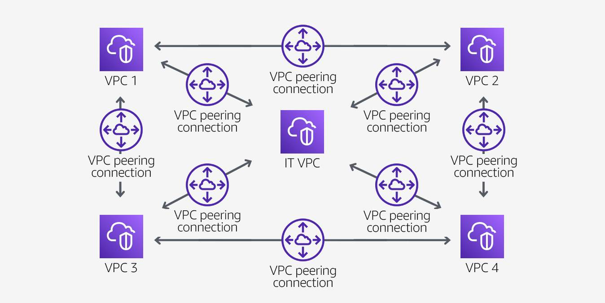
- **Partial sharing**
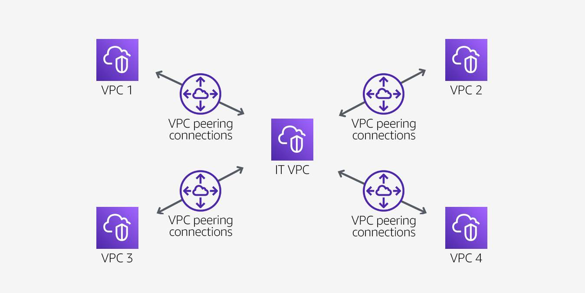

### Non-valid peering configurations
- **Overlaping CIDR blocks**
You cannot create a VPC peering connection between VPCs with matching or overlapping IPv4 
- **Transitive peering**
You have a VPC peering connection between VPC A and VPC B, and between VPC A and VPC C. There is no VPC peering connection between VPC B and VPC C. You cannot route packets directly from VPC B to VPC C through VPC A.
- **Edge-to-edge routing through a gateway or private connection**
If either VPC in a peering relationship has one of the following connections, you cannot extend the peering relationship to that connection:
	- A VPN connection or a Direct Connect connection to a corporate network
	- An internet connection through an internet gateway
	- An internet connection in a private subnet through a NAT device
	- A gateway VPC endpoint to an AWS service, for example, an endpoint to Amazon S3
	
	
## AWS Direct Connect
Direct Connect provides a private, reliable connection to AWS from your physical facility, such as a data center or office. It is a fully integrated and redundant AWS service that provides complete control over the data exchanged between your AWS environment and the physical location of your choice.

## AWS Site-to-Site VPN and AWS Client VPN
AWS VPN is comprised of two services: 
- AWS Site-to-Site VPN enables you to securely connect your on-premises network to Amazon VPC, for example your branch office site. 
- AWS Client VPN enables you to securely connect users to AWS or on-premises networks, for example remote employees. 

### AWS Site-to-Site VPN
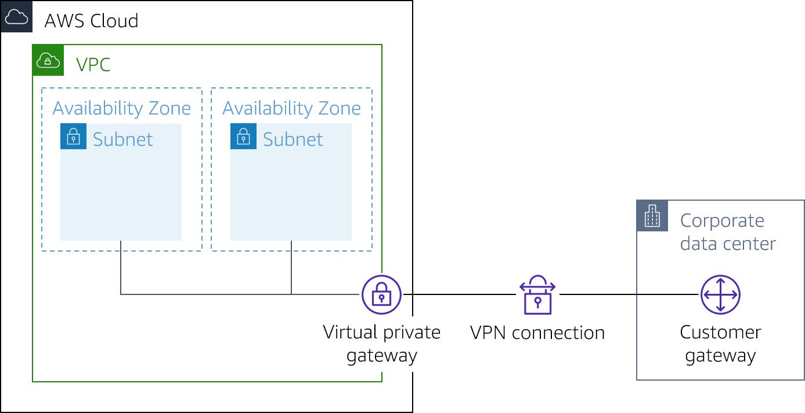

### Client VPN
Based on OpenVPN technology, Client VPN is a managed client-based VPN service that lets you securely access your AWS resources and resources in your on-premises network.

## AWS Transit Gateway
AWS Transit Gateway is a highly available and scalable service that provides interconnectivity between VPCs and your on-premises network. Within a Region, AWS Transit Gateway provides a method for consolidating and centrally managing routing between VPCs with a hub-and-spoke network architecture.

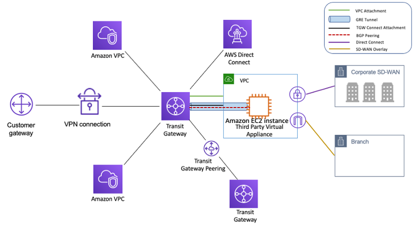

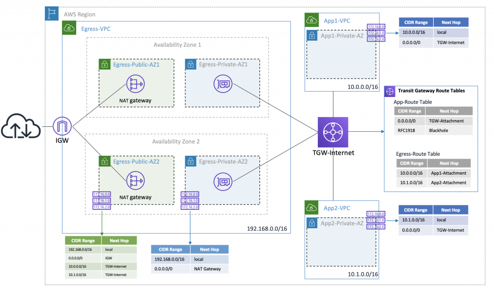

[TransitGateway workshop](https://catalog.workshops.aws/networking/en-US/beginner/lab1/030-tgw)
