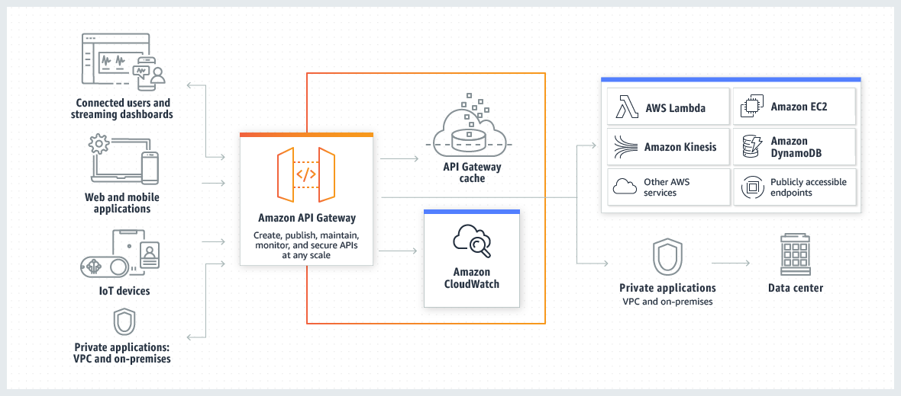

# Serverless

Building modern python applications on aws

## API Gateway

**API Gateway features:**
- Support for stateful (WebSocket) and stateless (HTTP and REST) APIs.
- Powerful, flexible authentication mechanisms, such as AWS Identity and Access Management policies, Lambda authorizer functions, and Amazon Cognito user pools.
- Developer portal for publishing your APIs.
- Canary release deployments for safely rolling out changes.
- CloudTrail logging and monitoring of API usage and API changes.
- CloudWatch access logging and execution logging, including the ability to set alarms. For more information, see Monitoring REST API execution with Amazon CloudWatch metrics and Monitoring WebSocket API execution with CloudWatch metrics.
- Ability to use AWS CloudFormation templates to enable API creation. For more information, see Amazon API Gateway Resource Types Reference and Amazon API Gateway V2 Resource Types Reference.
- Support for custom domain names.
- Integration with AWS WAF for protecting your APIs against common web exploits.
- Integration with AWS X-Ray for understanding and triaging performance latencies.
- integrations with other aws service (Lambda, DynamoDB etc.)

Using Amazon API Gateway, you can create private REST APIs that can only be accessed from your virtual private cloud in Amazon VPC by using an interface VPC endpoint. This is an endpoint network interface that you create in your VPC. 

There are 2 types of stateless gateway types HTTP and REST. HTTP is cheaper but REST more feature reach. Comparsion [here](https://docs.aws.amazon.com/apigateway/latest/developerguide/http-api-vs-rest.html).

We can define `Models` and `Mapings` with rest API for validating and transforming request or response data.

API Gateway can integrate with number of AWS services:

### Stages

A stage is a named reference to a deployment, which is a snapshot of the API. You use a Stage to manage and optimize a particular deployment. For example, you can configure stage settings to enable caching, customize request throttling, configure logging, define stage variables, or attach a canary release for testing. [Read more](https://docs.aws.amazon.com/apigateway/latest/developerguide/rest-api-publish.html)

---

## AWS Lambda

AWS Lambda is a compute service that lets you run code without provisioning or managing servers. AWS Lambda executes your code only when needed and scales automatically, from a few requests per day to thousands per second. You pay only for the compute time you consume - there is no charge when your code is not running. With AWS Lambda, you can run code for virtually any type of application or backend service - all with little to no administration in regards to environment provisioning and scaling.

I have some additional notes [here](https://github.com/yarik2215/AWS-Lambda-Notes)

Lambda have 3 invocation types:

Async executions using Lambda Destinations:

---

## Step Function

Step Functions allows you to create
a state machine that consists of one or many states. It keeps track of the state of the state machine, as well as keeping a history of executions of that state machine. 

States can perform a variety of functions in your state machine:
- Do some work in your state machine (a Task state)
- Make a choice between branches of execution (a Choice state)
- Stop an execution with a failure or success (a Fail or Succeed state)
- Simply pass its input to its output or inject some fixed data (a Pass state)
- Provide a delay for a certain amount of time or until a specified time/date (a Wait state)
- Begin parallel branches of execution (a Parallel state)
- Dynamically iterate steps (a Map state)

There are 3 type of services integrations:
-  	Request Response
-  	Run a Job (.sync)
-  	Wait for Callback (.waitForTaskToken)

There are 2 workflow types Standard and Express:
express workflows performs faster and builded by duration but support only Request Response integrations, and doesn't persist state in disk but save state in memory, so it's executes at least one, not exactly once.

**Standard workflows:**
- 2,000 per second execution rate
- 4,000 per second state transition rate
- Priced per state transition
- Shows execution history and visual debugging
- Supports all service integrations and patterns

**Express workflows:**
- 100,000 per second execution rate
- Nearly unlimited state transition rate
- Priced per number and duration of executions
- Sends execution history to Amazon CloudWatch
- Supports all service integrations and most patterns

> Tasks for Express workflow should be indepotent

### Resources:
[Building Business Workflows with AWS Step Functions](https://www.youtube.com/watch?v=c797gM0f_Pc)

## Event Driven Architecture

---

## Observation

### AWS X-Ray
AWS X-Ray is a service that collects data about requests that your application serves, and provides tools that you can use to view, filter, and gain insights into that data to identify issues and opportunities for optimization. For any traced request to your application, you can see detailed information not only about the request and response, but also about calls that your application makes to downstream AWS resources, microservices, databases, and web APIs.

- `Segments` - The compute resources running your application logic send data about their work as segments. A segment provides the resource's name, details about the request, and details about the work done.

- `Subsegments` - A segment can break down the data about the work done into subsegments. Subsegments provide more granular timing information and details about downstream calls that your application made to fulfill the original request. A subsegment can contain additional details about a call to an AWS service, an external HTTP API, or an SQL database. You can even define arbitrary subsegments to instrument specific functions or lines of code in your application..

- `Trace` - A trace ID tracks the path of a request through your application. A trace collects all the segments generated by a single request. 

- `Sampling` - To ensure efficient tracing and provide a representative sample of the requests that your application serves, the X-Ray SDK applies a sampling algorithm to determine which requests get traced. By default, the X-Ray SDK records the first request each second, and five percent of any additional requests.

- `Annotations and metadata` -When you instrument your application, the X-Ray SDK records information about incoming and outgoing requests, the AWS resources used, and the application itself. You can add other information to the segment document as annotations and metadata. Annotations and metadata are aggregated at the trace level, and can be added to any segment or subsegment.

> Annotations are indexed for filter expression and metadata is not.

## Optimization

### Edge-Optimized response

Edge location is a point where some edge services can be located such as CloudFront, that can cache some data, or get it from the source but using AWS backbone instead of internet network.

### Caching

ApiGateway can cache responses. When you enable caching for a stage, API Gateway caches responses from your endpoint for a specified time-to-live (TTL) period, in seconds. API Gateway then responds to the request by looking up the endpoint response from the cache instead of making a request to your endpoint. The default TTL value for API caching is 300 seconds. The maximum TTL value is 3600 seconds. TTL=0 means caching is disabled.

### AWS Lambda @ Edge

Lambda@Edge is a feature of Amazon CloudFront that lets you run code closer to users of your application, which improves performance and reduces latency. With Lambda@Edge, you don't have to provision or manage infrastructure in multiple locations around the world. You pay only for the compute time you consume - there is no charge when your code is not running.

## Resources

- [Serverlessland](https://serverlessland.com/)
- [AWS Blog](https://aws.amazon.com/ru/blogs/compute/tag/serverless/)

### Videos

- [Infrastracture From Code](https://www.youtube.com/watch?v=RmwKBPCo7o4&list=WL&index=28)
