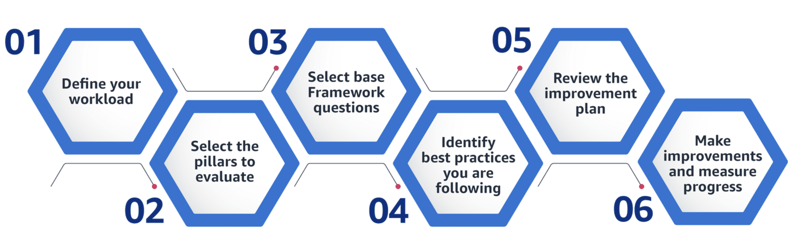

# The AWS Well-Architected Framework

The Well-Architected Framework Review is a collaborative conversation to evaluate the architecture of your workloads against the pillars and best practices of the AWS Well-Architected Framework.

## Reveiw process

- **Phase 1: Prepare for a review**
  - Define a workload
  - Identify pillar review participants
  - Locate workload architecture diagrams
  - Schedule a review
- **Phase 2: Perform the review**
  - Consider each pillar and its importance to your business context.
  - Evaluate your workload against a series of questions and best practices for each of the Framework pillars.
  - Document your findings. 
- **Phase 3: After the review**
  - Create a project plan for adopting the improvements.
  - Set clear dates and a cadence for how to implement the changes.
  - Get authorization to approve the budget and allocate resources for the implementation of recommended changes.
  - Update your review and track improvements as you address issues.
