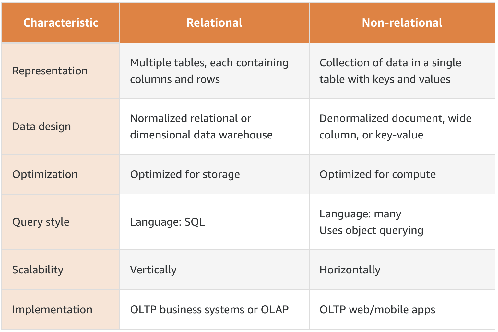
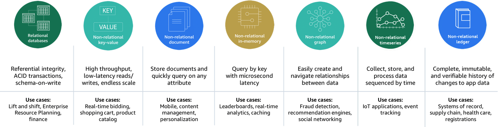

# Databases

AWS Database services:
- **Amazon RDS**
Amazon Relational Database Service (Amazon RDS) is a web service that makes it easier to set up, operate, and scale relational databases in the cloud. With Amazon RDS, you can manage common database administration tasks like OS patching, database updates, and backups. Supported database engines include PostgreSQL, MySQL, MariaDB, Oracle, and Microsoft SQL Server.
- **Amazon Aurora**
Amazon Aurora is part of the managed database service Amazon RDS. Aurora is MySQL and PostgreSQL compatible. With Aurora, you can combine the performance and availability of traditional enterprise databases with the simplicity and cost-effectiveness of open-source databases.
- **Amazon [[DynamoDB]]**
Amazon DynamoDB is a fully managed key-value, non-relational database service that provides fast and predictable performance with seamless scalability. With DynamoDB, you can create database tables that store and retrieve data and serve any level of request traffic. You can scale up or scale down your tables' throughput capacity without downtime or performance degradation.
- **Amazon DocumentDB**
Amazon DocumentDB (with MongoDB compatibility) is designed from the ground up to give you the performance, scalability, and availability you need when operating mission-critical MongoDB workloads at scale. In Amazon DocumentDB, the storage and compute are decoupled, allowing each to scale independently.
- **Amazon ElastiCache**
Amazon ElastiCache offers fully managed Redis and Memcached in-memory data stores. You can build data-intensive apps or improve the performance of your existing apps by retrieving data from high throughput and low latency in-memory data stores.
- **Amazon Neptune**
Amazon Neptune is a fast, reliable, fully managed graph database service for applications that work with highly connected datasets. Neptune offers read replicas for highly availability. You can create point-in-time copies, configure continuous backup to Amazon Simple Storage Service (Amazon S3) with replication across Availability Zones.
- **Amazon Redshift**
Amazon Redshift is an enterprise-level, petabyte scale, fully managed data warehousing service. With Amazon Redshift, you can achieve efficient storage and optimum query performance through a combination of massively parallel processing, columnar data storage, and very efficient, targeted data compression encoding schemes.

## Relational vs Non relational

## Non relational databases

### Key-value databases
Key-value databases logically store data in a single table. Within the table, the values are associated with a specific key and stored in the form of blob objects without a predefined schema. The values can be of nearly any type.

**Strengths**
- Very flexible
- Able to handle a wide variety of data types
- Keys are linked directly to their values with no need for indexing or complex join operations
- Content of a key can easily be copied to other systems without reprogramming the data

**Weaknesses**
- Analytical queries are difficult to perform due to the lack of joins
- Access patterns need to be known in advance for optimum performance

### Document databases
Document stores keep files containing data as a series of elements. These files can be navigated using numerous languages including Python and Node.js. Each element is an instance of a person, place, thing, or event. For example, a document store may hold a series of log files from a set of servers. These log files can each contain the specifics for that system without concern for what the log files in other systems contain.

**Strengths**
- Flexibility
- No need to plan for a specific type of data when creating one
- Easy to scale

**Weaknesses**
- Sacrifice ACID compliance for flexibility
- Databases cannot query across files natively

### In-memory databases

In-memory databases are used for applications that require real-time access to data. Most databases have areas of data that are frequently accessed but seldom updated. Additionally, querying a database is always slower and more expensive than locating a key in a key-value pair cache. Some database queries are especially expensive to perform. By caching such query results, you pay the price of the query once and then are able to quickly retrieve the data multiple times without having to re-execute the query.

**Strengths**
- Support the most demanding applications requiring sub-millisecond response times
- Great for caching, gaming, and session store
- Adapt to changes in demands by scaling out and in without downtime
- Provide ultrafast (sub-microsecond latency) and inexpensive access to copies of data

**Weaknesses**
- Data that is rapidly changing or is seldom accessed
- Application using the in-memory store has a low tolerance for stale data

### Graph databases
Graph databases store data as nodes, while edges store information on the relationships between nodes. Data within a graph database is queried using specific languages associated with the software tool you have implemented. Review the Understanding graph relationships section below for more information.

**Strengths**
- Allow simple, fast retrieval of complex hierarchical structures
- Great for real-time big data mining
- Can rapidly identify common data points between nodes
- Great for making relevant recommendations and allowing for rapid querying of those relationships

**Weaknesses**
- Cannot adequately store transactional data
- Analysts must learn new languages to query the data
- Performing analytics on the data may not be as efficient as with other database types

---

## Common database types and use cases

## Caching strategies

[Database Caching Strategies Using Redis](https://docs.aws.amazon.com/whitepapers/latest/database-caching-strategies-using-redis/welcome.html)