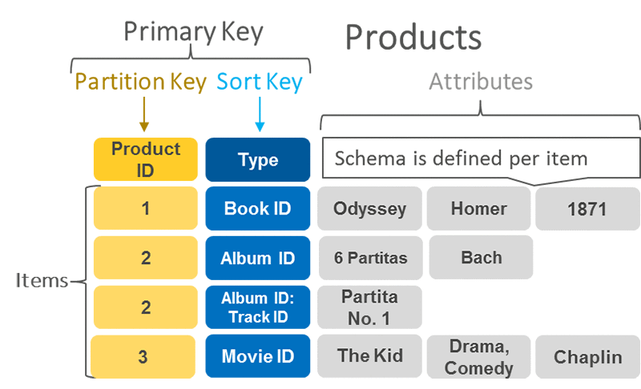
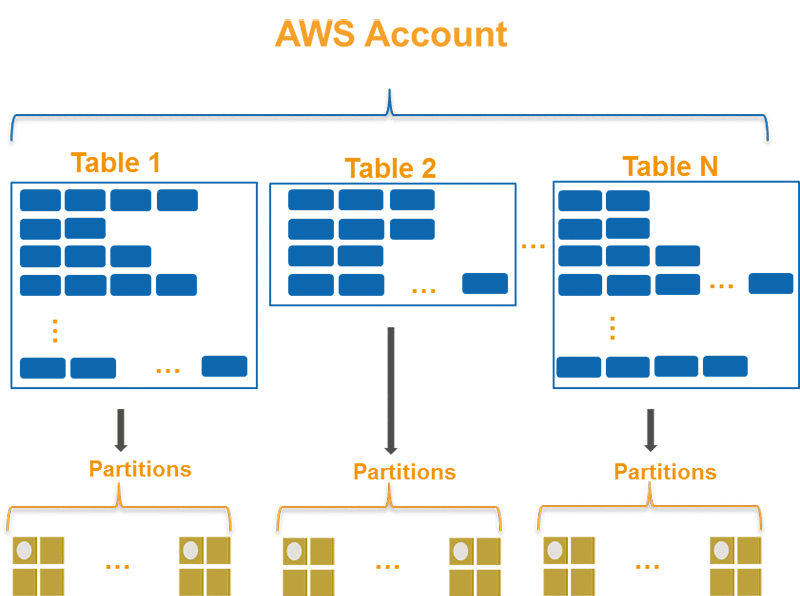
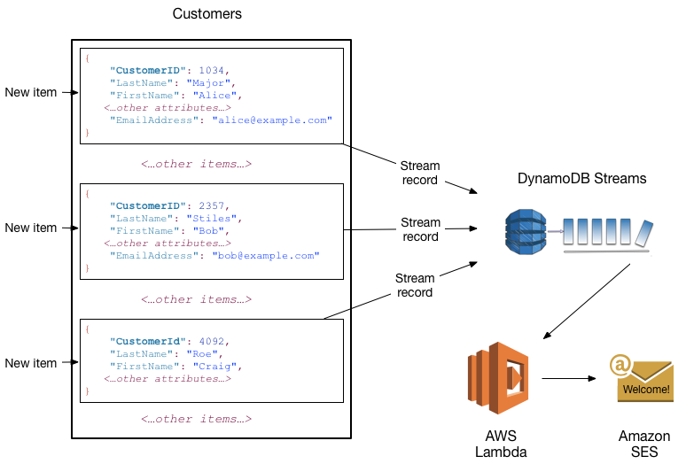
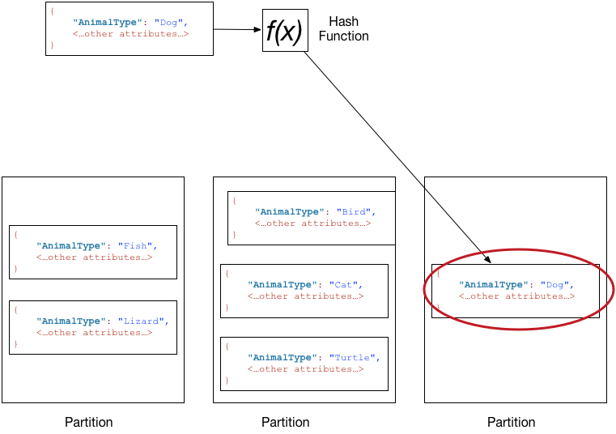
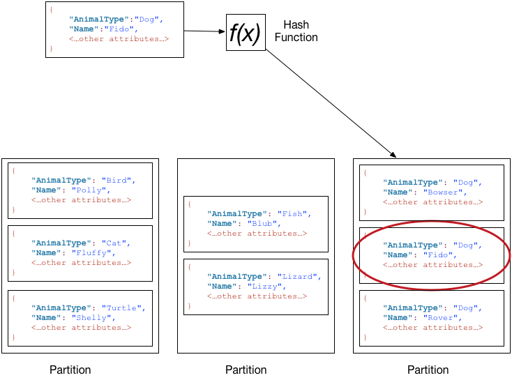
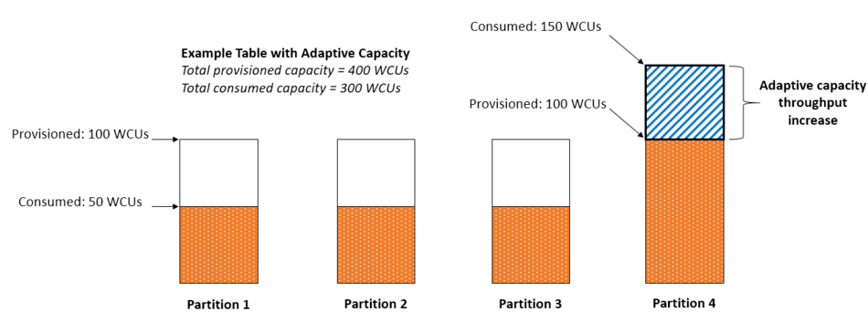
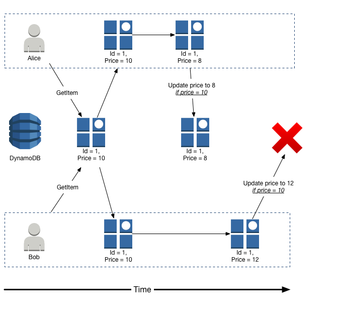
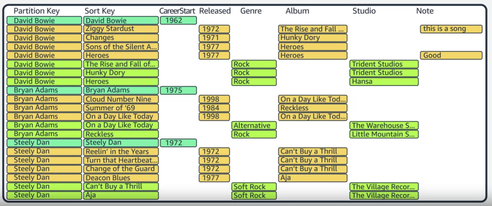

# DynamoDB

DynamoDB is key-value database, it's highly scalable and available. 

## CAP
In theoretical computer science, the **CAP** theorem, also named Brewer's theorem after computer scientist Eric Brewer, states that any distributed data store can provide only two of the following three guarantees:
- `Consistency`: Every read receives the most recent write or an error.
- `Availability`: Every request receives a (non-error) response, without the guarantee that it contains the most recent write.
- `Partition tolerance`: The system continues to operate despite an arbitrary number of messages being dropped (or delayed) by the network between nodes.

## Tables, items, and attributes

The following are the basic DynamoDB components:

- `Tables` – Similar to other database systems, DynamoDB stores data in tables. A table is a collection of data. For instance, you could have a table called People that you could use to store personal contact information about friends, family, or anyone else of interest. You could also have a Cars table to store information about vehicles that people drive.
- `Items` – Each table contains zero or more items. An item is a group of attributes that is uniquely identifiable among all the other items. In a People table, each item represents a person. In a Cars table, each item represents one vehicle. Items in DynamoDB are similar in many ways to rows, records, or tuples in other database systems. In DynamoDB, there is no limit to the number of items you can store in a table.
- `Attributes` – Each item is composed of one or more attributes. An attribute is a fundamental data element, something that does not need to be broken down any further. For example, an item in a People table might contain attributes called PersonID, LastName, FirstName, and so on. In a Department table, an item might have attributes such as DepartmentID, Name, Manager, and so on. Attributes in DynamoDB are similar in many ways to fields or columns in other database systems.

## Partition key

DynamoDB supports two types of primary keys:

- **Partition key**: A simple primary key, composed of one attribute known as the partition key. Attributes in DynamoDB are similar in many ways to fields or columns in other database systems.
- **Partition key and sort key**: Referred to as a composite primary key, this type of key is composed of two attributes. The first attribute is the partition key, and the second attribute is the sort key. All data under a partition key is sorted by the sort key value. The following is an example.

> Max size of a partition is 10Gb

[How to chose a partition key?](https://aws.amazon.com/blogs/database/choosing-the-right-dynamodb-partition-key/)

## Limits

- Max item size is 400 Kb
- Min key length is 1 byte, max is 2048 for partition key and 1024 for the sort key

[More about limits](https://dynobase.dev/dynamodb-limits/)

## Secondary indexes

A secondary index is a data structure that contains a subset of attributes from a table, along with an alternate key to support Query operations. You can retrieve data from the index using a Query, in much the same way as you use Query with a table. A table can have multiple secondary indexes, which give your applications access to many different query patterns. 
>Secondary indexe allows us to create copy of table with alternative key schema

DynamoDB supports two kinds of indexes:

- **Global secondary index** – An index with a partition key and sort key that can be different from those on the table.
- **Local secondary index** – An index that has the same partition key as the table, but a different sort key.

> Each table in DynamoDB has a quota of 20 global secondary indexes (default quota) and 5 local secondary indexes.

## DynamoDB Streams

DynamoDB Streams is an optional feature that captures data modification events in DynamoDB tables. The data about these events appear in the stream in near-real time, and in the order that the events occurred.

Each event is represented by a stream record. If you enable a stream on a table, DynamoDB Streams writes a stream record whenever one of the following events occurs:

- A new item is added to the table: The stream captures an image of the entire item, including all of its attributes.
- An item is updated: The stream captures the "before" and "after" image of any attributes that were modified in the item.
- An item is deleted from the table: The stream captures an image of the entire item before it was deleted.

>Each stream record also contains the name of the table, the event timestamp, and other metadata. Stream records have a lifetime of 24 hours; after that, they are automatically removed from the stream.

## Data types

DynamoDB supports many different data types for attributes within a table. They can be categorized as follows:

- `Scalar Types` – A scalar type can represent exactly one value. The scalar types are number, string, binary, Boolean, and null.
- `Document Types` – A document type can represent a complex structure with nested attributes, such as you would find in a JSON document. The document types are list and map.
- `Set Types` – A set type can represent multiple scalar values. The set types are string set, number set, and binary set.

>When you create a table or a secondary index, you must specify the names and data types of each primary key attribute (partition key and sort key). Furthermore, each primary key attribute must be defined as type string, number, or binary.

## Read consistency

When your application writes data to a DynamoDB table and receives an HTTP 200 response (OK), the write has occurred and is durable. The data is eventually consistent across all storage locations, usually within one second or less.

DynamoDB supports eventually consistent and strongly consistent reads.

### Eventually Consistent Reads

When you read data from a DynamoDB table, the response might not reflect the results of a recently completed write operation. The response might include some stale data. If you repeat your read request after a short time, the response should return the latest data.

### Strongly Consistent Reads

When you request a strongly consistent read, DynamoDB returns a response with the most up-to-date data, reflecting the updates from all prior write operations that were successful. However, this consistency comes with some disadvantages:

- A strongly consistent read might not be available if there is a network delay or outage. In this case, DynamoDB may return a server error (HTTP 500).
- Strongly consistent reads may have higher latency than eventually consistent reads.
- Strongly consistent reads are not supported on global secondary indexes.
- Strongly consistent reads use more throughput capacity than eventually consistent reads. For details, see Read/write capacity mode

## Read/write capacity mode

Amazon DynamoDB has two read/write capacity modes for processing reads and writes on your tables:

 - On-demand
 - Provisioned (default, free-tier eligible)

> Secondary indexes inherit the read/write capacity mode from the base table. 

### Read request units

DynamoDB read requests can be either strongly consistent, eventually consistent, or transactional.

- A strongly consistent read request of up to 4 KB requires one read request unit.
- An eventually consistent read request of up to 4 KB requires one-half read request unit.
- A transactional read request of up to 4 KB requires two read request units.

### Write request units

One write request unit represents one write for an item up to 1 KB in size. If you need to write an item that is larger than 1 KB, DynamoDB needs to consume additional write request units. 

## Table classes 

DynamoDB offers two table classes designed to help you optimize for cost. The **DynamoDB Standard** table class is the default, and is recommended for the vast majority of workloads. The **DynamoDB Standard-Infrequent Access** (DynamoDB Standard-IA) table class is optimized for tables where storage is the dominant cost.

>The choice of a table class is not permanent

## Partitions 

###  Partition key
To write an item to the table, DynamoDB uses the value of the partition key as input to an internal hash function. The output value from the hash function determines the partition in which the item will be stored.

### Partition key and sort key
DynamoDB calculates the hash value of the partition key in the same way as described in Data distribution: Partition key. However, it stores all the items with the same partition key value physically close together, ordered by sort key value.

### Hot partitions

[How to chose a partition key](https://docs.aws.amazon.com/amazondynamodb/latest/developerguide/bp-partition-key-design.html)

## Transactions

With Amazon DynamoDB transactions, you can group multiple actions together and submit them as a single all-or-nothing TransactWriteItems or TransactGetItems operation. 

## Conditional writes

By default, the DynamoDB write operations (PutItem, UpdateItem, DeleteItem) are unconditional: Each operation overwrites an existing item that has the specified primary key.

DynamoDB optionally supports conditional writes for these operations. A conditional write succeeds only if the item attributes meet one or more expected conditions. Otherwise, it returns an error. 

## TTL

Amazon DynamoDB Time to Live (TTL) allows you to define a per-item timestamp to determine when an item is no longer needed. Shortly after the date and time of the specified timestamp, DynamoDB deletes the item from your table without consuming any write throughput. 

## Global tables

## Single table

Store different types of object in one table.

## Additional materials

- [How to use DynamoDB global secondary indexes to improve query performance and reduce costs](https://aws.amazon.com/ru/blogs/database/how-to-use-dynamodb-global-secondary-indexes-to-improve-query-performance-and-reduce-costs/)
- [Local Secondary Indexes for Amazon DynamoDB](https://aws.amazon.com/ru/blogs/aws/local-secondary-indexes-for-amazon-dynamodb/)
- [Creating a single-table design with Amazon DynamoDB](https://aws.amazon.com/ru/blogs/compute/creating-a-single-table-design-with-amazon-dynamodb/)
- [[Serverless]]
