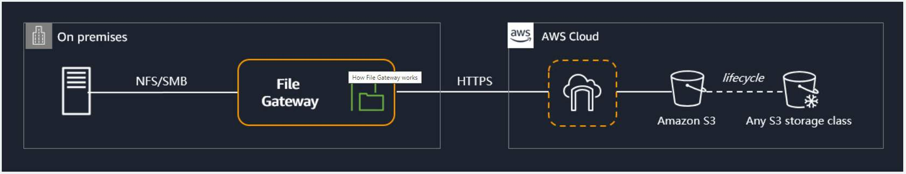
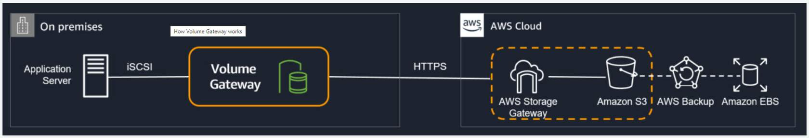

# [[S3]]

## Cost optimization

### S3 Lifecycle policies

Supported transitions

A lifecycle policy is a rule that moves objects between storage classes based on the object create date.
>Remember, Amazon S3 does not transition objects between storage classes if they are smaller than 128 KB because it's not cost effective to do so.

### Four pillars of cost optimization

* 
* 
* 
* 

### Understand your data access patterns

**Predictable workloads**:

* Amazon S3 Storage Class Analysis

**Unpredictable workloads**:

* Amazon S3 Intelligent-Tiering 

**AWS provides inventory and access logging tools:**

* Amazon S3 Inventory
* Amazon S3 Server Access logging
* AWS CloudTrail Logs

S3 Inventory is used to determine which objects are in your buckets. Server Access Logs and CloudTrail logs help you to determine which of these objects are being accessed and how frequently they are accessed. 

### Archival

There are 3 types of archival storage types:

* Amazon S3 Glacier Instant Retrieval
* S3 Glacier Flexible Retrieval
* S3 Glacier Deep Archive

## Storage Gateways

* 
* 
* 
